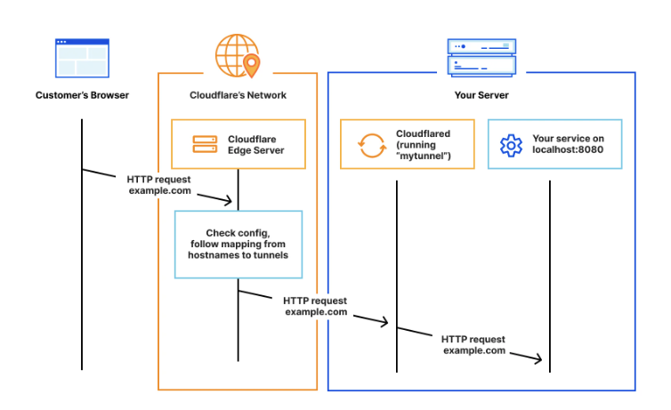

# Docker Infrastructure

```
Docker Network
+------------------------------------------------------------+
|  +-----------+     +-----------+     +--------------+      |
|  |           |--+->|  Django   |---->|  PostgreSQL  |      |
|  |           |  |  |  :8000    |     |    :5432     |      |
|  |   Caddy   |  |  +-----------+     +--------------+      |      +--------------+      +-------------+
|  | :8080/80  |  |                            ^             |<-----|  Prometheus  |<-----|   Grafana   |
|  |           |  |  +-----------+             |             |      |    :9090     |      |    :3000    |
|  +-----------+  |  |   React   |      +-------------+      |      +--------------+      +-------------+
|        ^        +->|  Node.js  |      |  Database   |      |             |
|        |           |   :3000   |      |   Backup    |      |             |
|        |           +-----------+      +-------------+      |             |
+--------|---------------------------------------------------+             |
         |                                                                 |
   +------------+                                                          |
   | Cloudflare |<---------------------------------------------------------+
   |   Tunnel   |
   +------------+
         ^
         |
      Browser
   (port 80/443)
```

# How it works

`cloudflared` establishes **outbound connections** (tunnels) between your resources and Cloudflare's global network. A tunnel is a persistent object identified by a UUID — it serves as the logical link between your origin and Cloudflare. Within the same tunnel, you can run as many `cloudflared` processes (**connectors**) as needed. Each connector sends traffic to the nearest Cloudflare data center.



---
# **Prerequisites**

- A **Cloudflare account ↗**
- A domain on cloudflare or any other domain registrar (required to publish applications)
- A server or VM with internet access where you will install `cloudflared`
    - Barebone or containerized

---
# Deploy the tunnel

- you find the tunnel token for your `.env` file here ➡️ .env
- start the cloudflared container
- go to `https://poolaki.de`
- the dev versions are also still available but they work without https now e.g. `http://poolaki.localhost`
    - the browser redirects to https when it was opened in the past, delete the browser cache / history an try again
- **Hint**: Grafana and Prometheus are not exposed to the internet so they also use http
    - `http://grafana.localhost` & `http://prometheus.localhost`