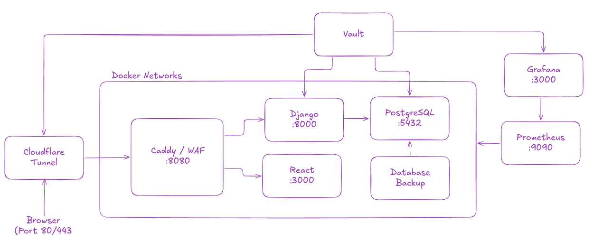
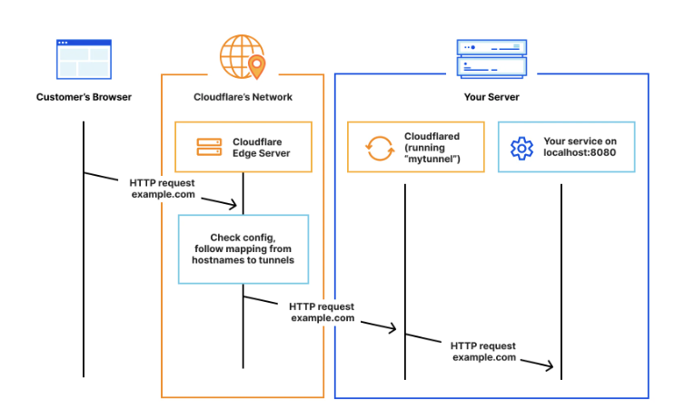

# Docker Infrastructure



# How it works

`cloudflared` establishes **outbound connections** (tunnels) between your resources and Cloudflare's global network. A tunnel is a persistent object identified by a UUID — it serves as the logical link between your origin and Cloudflare. Within the same tunnel, you can run as many `cloudflared` processes (**connectors**) as needed. Each connector sends traffic to the nearest Cloudflare data center.



---
# **Prerequisites**

- A **Cloudflare account ↗**
- A domain on cloudflare or any other domain registrar (required to publish applications)
- A server or VM with internet access where you will install `cloudflared`
    - Barebone or containerized

---
# Deploy the tunnel

- you find the tunnel token for your `.env` file here ➡️ .env
- start the cloudflared container
- go to `https://poolaki.de`
- the dev versions are also still available but they work without https now e.g. `http://poolaki.localhost`
    - the browser redirects to https when it was opened in the past, delete the browser cache / history an try again
- **Hint**: Grafana and Prometheus are not exposed to the internet so they also use http
    - `http://grafana.localhost` & `http://prometheus.localhost`


---
# Web application firewall

Coraza is an open source, enterprise-grade, high performance Web Application Firewall (WAF).
It written in Go, supports ModSecurity SecLang rulesets and is 100% compatible with the OWASP Core Rule Set.

For more information visit: https://www.coraza.io/docs/tutorials/introduction/

## Testcommands

**== SQL Injection attempt ==**

**in terminal**
```
curl -G "http://poolaki.de/api/" --data-urlencode "id=1' OR '1'='1"
```
```
curl -G "http://poolaki.localhost:8080/api/" --data-urlencode "id=1' OR '1'='1"
```

**in Browser**
```
http://poolaki.de/api/?id=1' OR '1'='1
```
```
http://poolaki.localhost:8080/api/?id=1' OR '1'='1
```
---

**== XSS attempt ==**

in terminal
```
curl "http://poolaki.de/api/?q=<script>alert(1)</script>"
```
```
curl "http://poolaki.localhost:8080/api/?q=<script>alert(1)</script>"
```
in Browser
```
http://poolaki.de/api/?q=<script>alert(1)</script>
```
```
http://poolaki.localhost:8080/api/?q=<script>alert(1)</script>
```

---

**== Path traversal ==**

*Percent encoding (aka URL encoding)*
 
`%2e%2e%2f` represents `../`

The decoded path looks like:
`http://poolaki.de/api/../../etc/passwd`

in terminal
```
curl "http://poolaki.de/api/%2e%2e%2f%2e%2e%2fetc%2fpasswd"
```
```
curl "http://poolaki.localhost:8080/api/%2e%2e%2f%2e%2e%2fetc%2fpasswd"
```

in browser
```
http://poolaki.de/api/%2e%2e%2f%2e%2e%2fetc%2fpasswd
```
```
http://poolaki.localhost:8080/api/%2e%2e%2f%2e%2e%2fetc%2fpasswd
```

---

**== Bad User-Agent (scanner detection) ==**

in terminal
```
curl -A "sqlmap/1.0" "http://poolaki.localhost:8080/api/"
```
```
curl -A "sqlmap/1.0" "http://poolaki.de/api/"
```

---

**== Command injection ==**

in terminal
```
curl "http://poolaki.localhost:8080/api/?cmd=;cat%20/etc/passwd"
```
```
curl "http://poolaki.de/api/?cmd=;cat%20/etc/passwd"
```
in browser
```
http://poolaki.localhost:8080/api/?cmd=;cat%20/etc/passwd
```
```
http://poolaki.de/api/?cmd=;cat%20/etc/passwd
```

---

After each command you can run the following command. 
It creates a file named `auditlog` with all details for the last log from coraza.

```
docker compose exec caddy tail -1 /coraza/logs/audit.log | jq > auditlog_lastLine
```

You can see a lot of informations like the attacked server, the attack type and if it was blocked by the firewall.

``` title:audit.log
"server_id": "poolaki.localhost",
...
"error_message": "[client \"172.21.0.1\"] Coraza: Warning. SQL Injection Attack Detected...
...
```